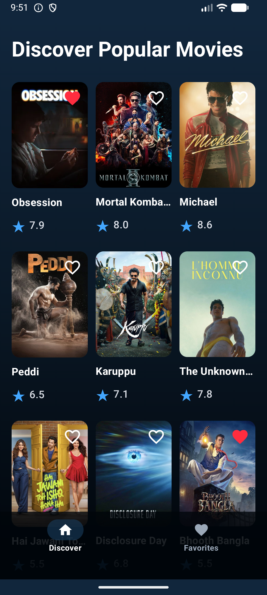
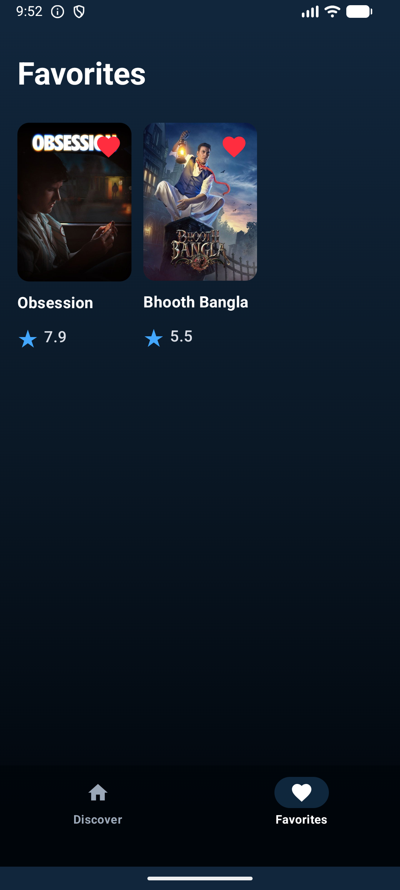
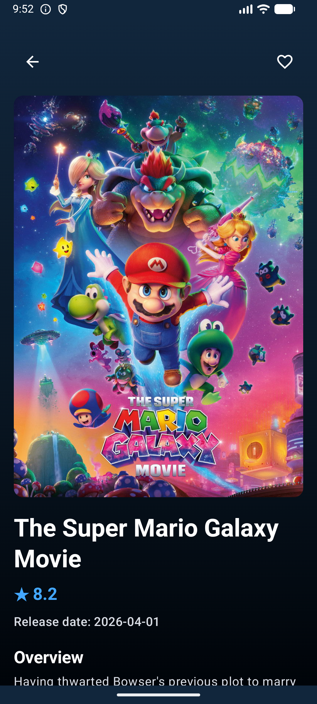
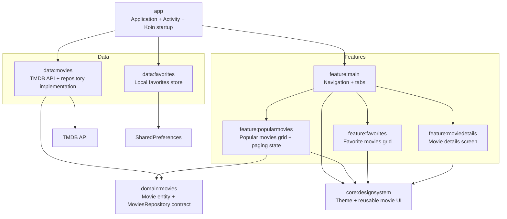

# Movies

Modular Android movie app built with Kotlin, Jetpack Compose, Koin, Ktor, Coil, and The Movie Database API.

## Screenshots

| Discover | Favorites | Details |
| --- | --- | --- |
|  |  |  |

## Architecture

The app is split into small Gradle modules around presentation, domain, data, and shared design system responsibilities.



Important runtime flow:

1. `MoviesApplication` starts Koin and registers the data modules.
2. `MoviesActivity` injects `MoviesRepository` and `FavoriteMoviesStore`.
3. `MoviesHomeScreen` creates `PopularMoviesState` and routes between home/details.
4. `PopularMoviesState` requests pages through `MoviesRepository`.
5. `TmdbMoviesRepository` calls `MoviesApi`, maps DTOs into domain `Movie` entities, and returns them to Compose UI.

See [docs/architecture.md](docs/architecture.md) for the fuller Mermaid diagrams.

## Local Setup

Add a TMDB API key to `local.properties`:

```properties
TMDB_API_KEY=your_api_key_here
```

Then build the app:

```bash
./gradlew :app:assembleDebug
```
