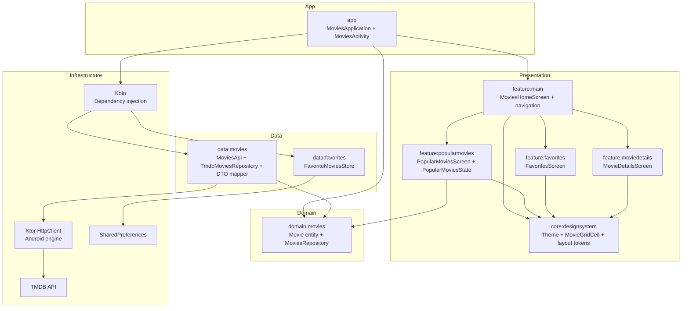
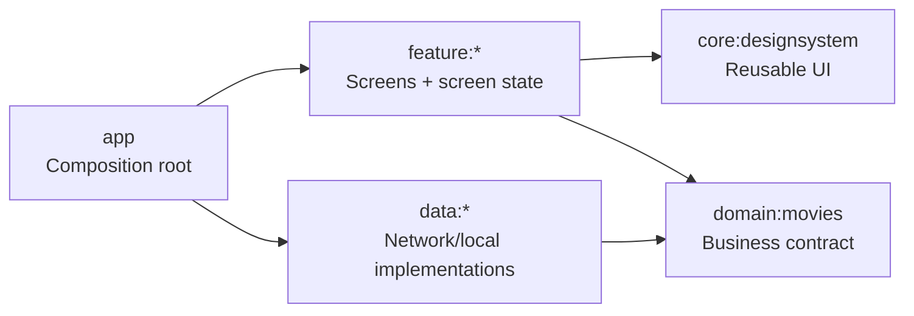
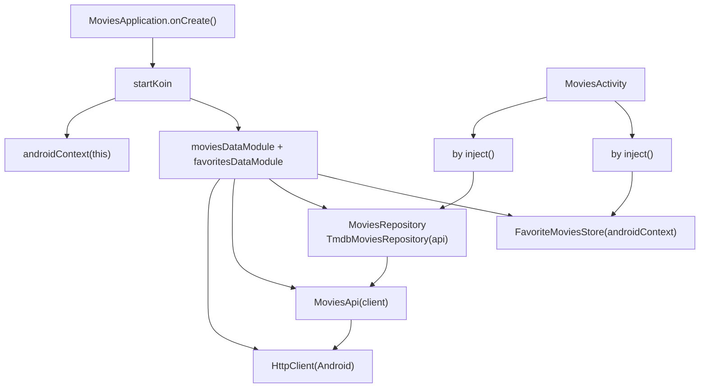
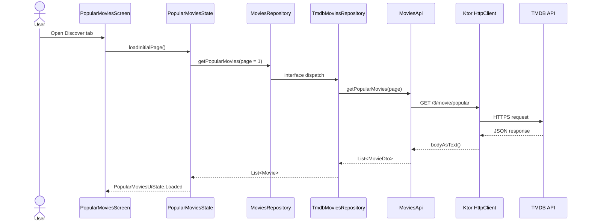
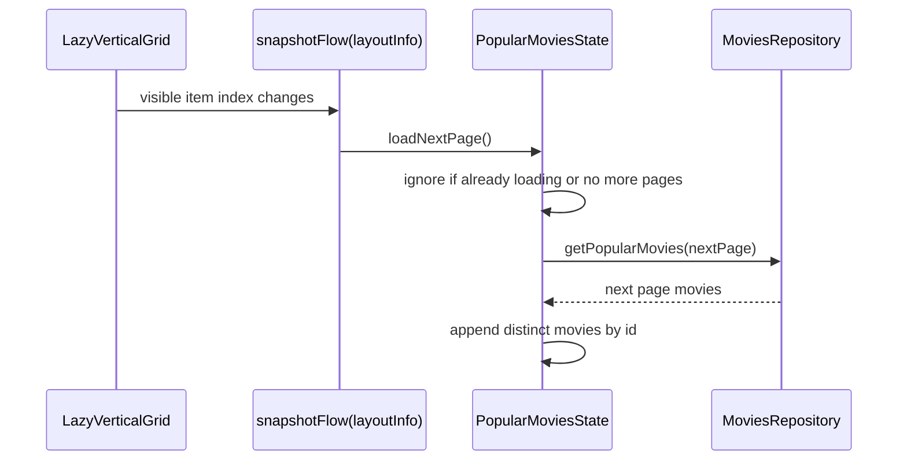
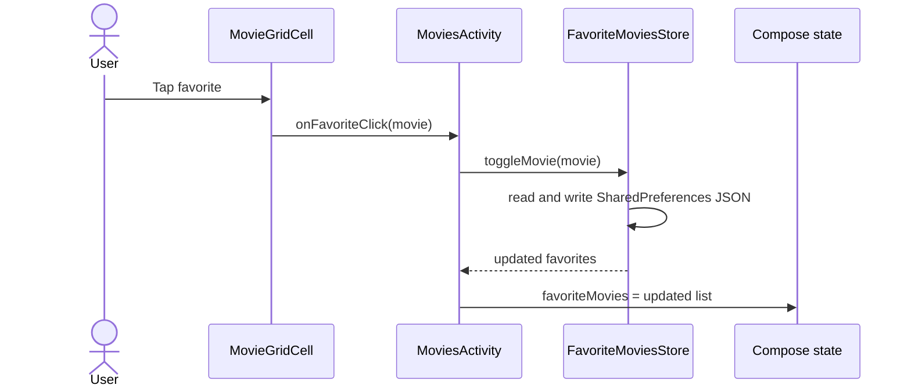
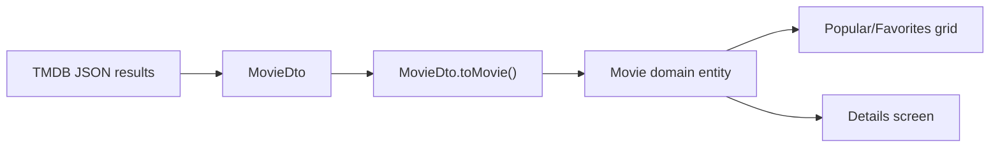
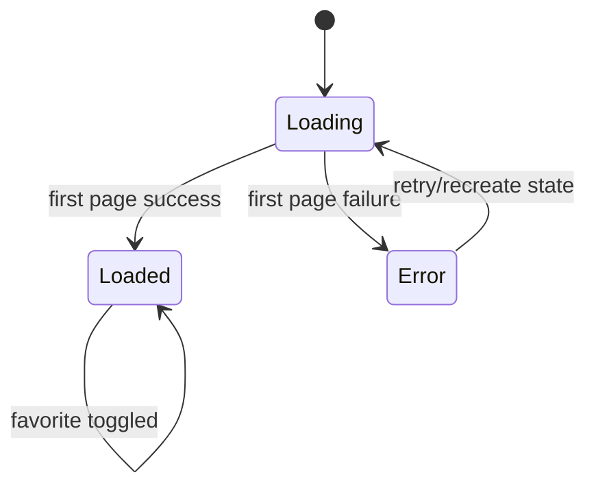

# Architecture

## System Overview

## Module Responsibilities

## Dependency Wiring

## Popular Movies Data Flow

## Pagination Flow

## Favorites Flow

## Data Mapping

## UI State Lifecycle

